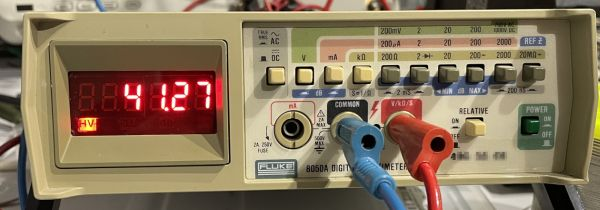
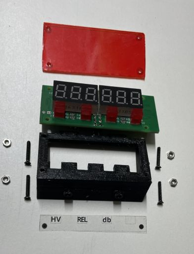
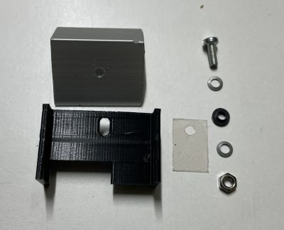
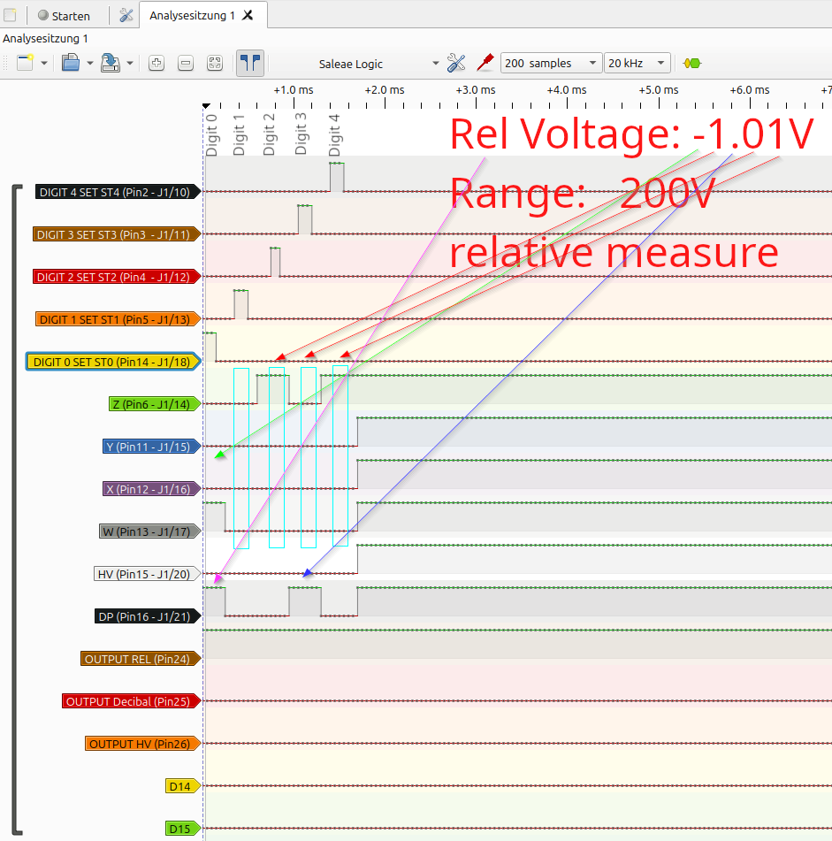
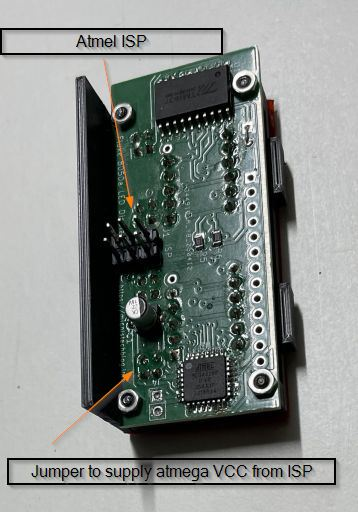
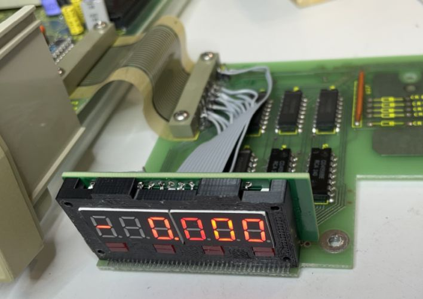
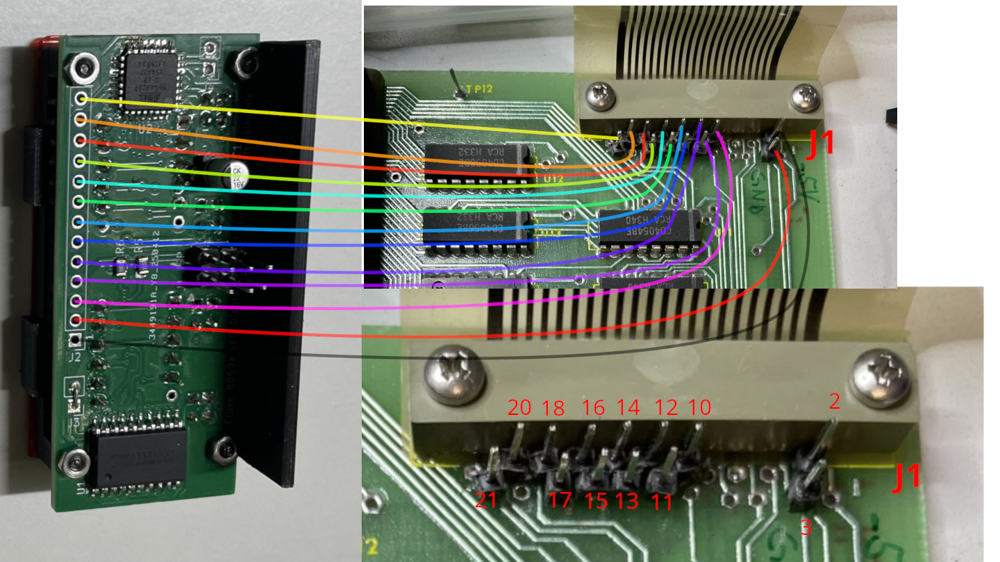
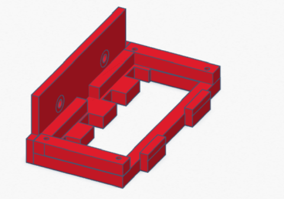
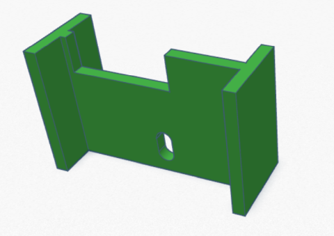
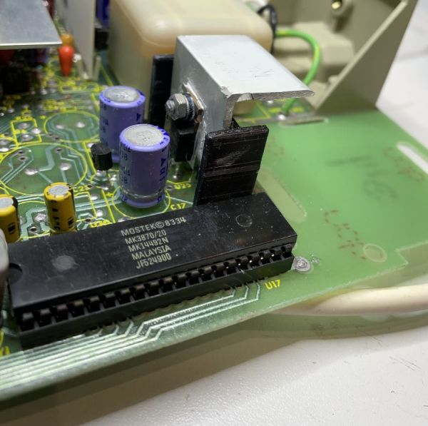

# Yet another Fluke 8050a Display replacement kit

There already several cool other projects for a creating a new display for this type of multimeter where the LCD display is broken.

Here are some examples. 
* [vondervotteimittiss.de](https://www.vondervotteimittiss.de/post/a-new-led-display-for-a-fluke-8050a-multimeter)
* [sps-wagner.de](https://www.sps-wagner.de/Sonstiges/8050A.html)
* [hackaday.com](https://hackaday.com/2022/06/17/hacking-a-new-display-into-a-fluke-8050a-multimeter/)

Based on their work I created my own version. My goal was to create a solution that is easy to install.



 So the honer for reverse engineering of the 8050a goes to [Michael Damkier](https://www.vondervotteimittiss.de/) and also to [jasonacox](https://github.com/jasonacox) for the TM1637TinyDisplay library on which my project based.

My project uses an Atmel atmega328p microcontroller which I used for other [projects](https://github.com/Race666/masterclock) too.

The precompiled firmware file could be found [here](./src/pio/.pio/build/ATmega328P/firmware.hex)

Flash the with these fuses (8MHz internal clock)
```
avrdude -c usbtiny -p atmega328p -U lfuse:w:0x62:m -U hfuse:w:0xDE:m -U efuse:w:0x05:m -U flash:w:./src/pio/.pio/build/ATmega328P/firmware.hex
```

Overview over the project folders
| Folder  | Description  |
|---|---|
|[/images](./images)|Images for this wiki|
|[/LogicAnalysis](./LogicAnalysis)|Images with Pulseview Screenshots|
|[/pcb](./pcb)|KiCad project with schematic and PCB|
|[/src](./src)|Platform IO firmware project for atmega328p|
|[/stl](./stl)|3D Data for display- and heatsink holder|


The project has multipe parts



* The platform IO firmware [project](./src/) for the atmega328p microcontroller
* 4 Layer display [PCB](./pcb/) create with KiCad
* A [Display holder](./stl/Fluke%208050a%20Displayhalter.stl) STL for printing by a 3D printer so that the display exctly fits in :-)
* A [holder](./stl/Halter%20Kühlkörper.stl) for a heat sink for the -5V regulator on the mainboard. The Display board consumes more power then the LCD Display so the -5V regulator needs some cooling

In addition to [vondervotteimittiss.de](https://www.vondervotteimittiss.de/post/a-new-led-display-for-a-fluke-8050a-multimeter) I also analysed the logic of the J1 connector from the Fluke display board. I traced the signals by a Hantek logic analyser and pulseview. The traces can be shows [here](./LogicAnalysis/) and looks like this example (Output Pins are the atmega328p outputs for LED's):



It's always the same format. The DIGIT (select) Pins are corrosponding to the Fluke Display from left to right. 

    Fluke Digit Count
                 _    _    _    _
             |  | |  | |  | |  | | 
         +/-     -    -    -    -
             |  | |  | |  | |  | | 
                 ͞     ͞     ͞     ͞        
     Digit  0    1    2    3    4    

When one of the digit pins get's high the data are submitted by the Pins Z, Y, X, W, HV, DP. A schematic/Service Manual of the Fluke 8050a can be found [here](https://xdevs.com/doc/Fluke/FLUKE%208050A%20Instruction.pdf) or [here](http://manuals.chudov.com/Fluke-8050A.pdf). See Page 7-4, 7-5, the DIGITx signal are labeled as STx in the schematic.

When DIGIT 1-4 are set the Pins Z, Y, X, W represents(as 4Bits) the number which is show at the display. While Z is the LSB (Least Significant Bit) and W the MSB (Most Significant Bit) and the DP signals where to position the decimal point in the display. The decimal point must be shown left to the current transmitted digit. For example (see logic trace) if the DP flag is set in digit 3 then the decimal point is between digit 2 and 3.

DIGIT 0 transfer some more information over Z, Y, X, W, HV, DP.
* HV signals the High Voltage info
* DP in digit 0 signals a relative measure/the relative measure button is locked
* When Z is set "1" is shown at digit postition 0
* When X is not set the measure is negative

|   |   |   |   |
|---|---|---|---|
| W=1 | X=1 | Y=0 | Voltage/Current measure          |
| W=1 | X=0 | Y=0 | negative Voltage/Current measure | 
| W=1 | X=0 | Y=1 | Decibel measure                  |
| W=0 | X=0 | Y=0 | Resistor measure                 |

## The LED display board
The LED display board is a 4 layer PCB created by [KiCad](https://www.kicad.org "Great tool"). Where I used very common parts:
* Atmega328p microcontroller
* TM1637 LED 7 segment driver
* 3361BS 7 segment displays




The display board has 4 Leds below the 7 segment displays to signal high voltage, decibel and relative measure.

The 6 Pin header is an atmega ISP port.
| Pin | Signal |
|---|---|
|1| MISO |
|2|VCC|
|3|SCK|
|4|MOSI|
|5|RST|
|6|GND|


The header pins for connecting to the fluke display board are ordered so wiring is simple:


## 3D printer parts

### Holder for the PCB



### Heatsinkholder/stabilizer


